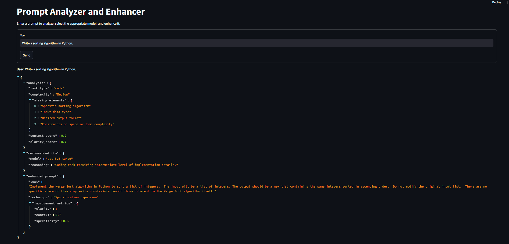

# LLM Prompt Engineering Assessment

**Optimized prompts for more accurate, clear, and contextually relevant responses from large language models (LLMs).**
---

## Table of Contents
- [Description](#description)
- [Environment Setup](#environment-setup)
- [File Execution Workflow](#file-execution-workflow)
- [Output](#output)
---

## Description

#### Optimized Prompt Engineering for Enhanced Query Responses

This project is designed to improve the quality of prompts for large language models (LLMs). By refining and enhancing the initial queries, the application aims to generate more accurate, clear, and contextually relevant outputs. Our focus is on:

- Identifying and incorporating missing elements
- Enhancing content quality
- Improving clarity
- Providing precise instructions

Ultimately, this results in optimized prompts that yield precise and high-quality outputs from the LLMs.
---

### Ensure .env with Your API Key:
Create a `.env` file in the root directory and add your Google API key:
```bash
GOOGLE_API_KEY=Your_Key
```

## Environment Setup

### Create a Virtual Environment

Use Conda to create and activate a Python 3.10 environment for this project:
```bash
conda create --name totem python=3.10
conda activate totem
pip install -r requirements.txt
```


## File Execution Workflow

### Test the Code
Run the `prompt_llm.py` script to verify all code is working:

```bash
cd Totem_Interactive/
export PYTHONPATH=$(pwd)
python3 prompt_llm.py
```

### Application Deployment (Test with Streamlit UI for User Experience:)

Launch the application with the `streamlit_app.py` script to start the Streamlit interface for inference:
```bash
streamlit run streamlit_app.py
```

### API Testing (Test the API (FastAPI)):

Test the API with the `main.py` script and ensure every endpoint's response:
```bash
uvicorn main:app --reload
```

## Output

Below is an example of the application interface showing the optimized prompts output:


## Contributing

Contributions are welcome! If you'd like to contribute to this project, please feel free to fork the repository and submit a pull request. We appreciate your feedback and suggestions to help improve the project.

If you encounter any issues or have ideas for new features, please open an issue on the repository. Your input is valuable to us, and we strive to make this project better with the help of the community.
